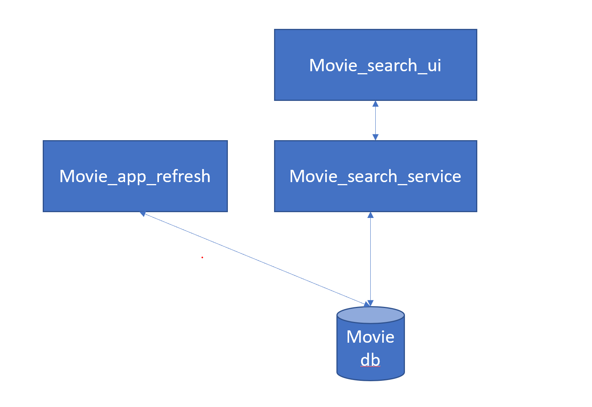

# Architecture and Design of Movies Search App

## Monolithic vs Microservice
- The Architecture of the Movies Search App started with a monolithic architecture in mind which included a single front end code talking to a backend code and a persistence storage. 
- Given that system design was a key consideration, this design would have been tightly coupled making it not extensible and scalable in future.
- As search was a key functionality, the choice of persistence would also be hampered due to monolithic architecture


- Hence, i decided to design the app as a microservice app consisting of 3 microservices:



  - movie_app_refresh : a atmoic microservice NodeJS app that allows to refresh the movie data on demand . this microservice has a single http end that can be called whenever a refresh of the movie data is required.
  - movie_search_service : consisting of a NodeJS app that only deals handling search queries and returning responses.
  - movie_search_ui : front end react app that communicates with movie_search_service to show the search GUI and results to users.


  ## MonoRepo Vs PolyRepo in github
  Since each microservice will have its own deployment life cycle , a poly repo approach was more feasable for this task :

  | Service                 | Repository                                                                                                                                                                                                                                                  |  |       |   |
| -------------------- | ------------------------------------------------------------------------------------------------------------------------------------------------------------------------------------------------------------------------------------------------------------ | --------- | --------- | ------------- |
| `movies_app_refresh`         | https://github.com/AkshayRsenal/movie_app_backend                                                                                                                                                                                       |     |   |             |
| `movies_search_service` | https://github.com/AkshayRsenal/search_movies_service                                                                                         |    |  |         |
| `movies_search_ui`  | https://github.com/AkshayRsenal/search_movies_ui |    |   |             |


## Choice of database 
- the microservice architecture made the choice of database little easier. Since we are mainly interested in search i chose Elastic Search as the document store to store the movie related data. 
- At first i tried to install Elastic Search on my local machine for local development. After the first successfully document ingest, i realised hosting Elastic Search for demo purposes will not be an easy task so i used the 14-day free trial Elastic Search Cloud (Note after the Cloud Elastic Search account will expire on 22 May 2021 and the app may not behave as expected post that )

## Deployment Consideration 
- Having a good understanding that running code on local machine will never be the same as running it on a productive environment, I wanted to deploy all my code on free hoisting server for it to be publicly available 
- I chose Heroku as a free hoisting provider . All my Apps are now publicly available


 | Service                 | Deployed URL                                                                                                                                                                                                                                                  |  |       |   |
| -------------------- | ------------------------------------------------------------------------------------------------------------------------------------------------------------------------------------------------------------------------------------------------------------ | --------- | --------- | ------------- |
| `movies_app_refresh : NodeJS`        | https://obscure-sands-07920.herokuapp.com/                                                                                                                                                                                      |     |   |             |
| `movies_search_service : NodeJS ` | https://afternoon-river-45089.herokuapp.com/                                                                                         |    |  |         |
| `movies_search_ui : React App`  | https://blooming-waters-11910.herokuapp.com/ |    |   |             |


## Open Points and further improvements
- The password for the cloud elastic search must not be store in free text and if possible as a environment variable in Heroku.
- Elastic Search is the simple text and can be extended to include fuzzy matching to make the search more effective.
- Although the poster url is fetched in the react app, the app is not currently rendering the image
- unit testing was not performed and should be included


# Getting Started with running the app locally

## movie_search_ui


Make sure you have [Node.js](https://nodejs.org/en/) and [npm](https://www.npmjs.com/get-npm) installed. 

clone the repo and install the npm dependencies
```
git clone https://github.com/AkshayRsenal/search_movies_ui
```
```
cd search_movies_ui
```
```
npm install
```
```
npm run start
```

the react app must be available at `localhost:3000`

Note : the microservice `movie_search_ui` will speak to `movie_search_service` to fetch movie details so make sure to begin `movie_search_service` as well

## movie_search_service


Make sure you have [Node.js](https://nodejs.org/en/) and [npm](https://www.npmjs.com/get-npm) installed. 

clone the repo and install the npm dependencies
```
git clone https://github.com/AkshayRsenal/search_movies_service
```
```
cd search_movies_service
```
```
npm install
```
```
npm run start
```

the node app must be available at `localhost:5000`

the search URL end point is :   `localhost:5000/movies/:category/:keyword`

## movie_app_refresh


Make sure you have [Node.js](https://nodejs.org/en/) and [npm](https://www.npmjs.com/get-npm) installed. 

clone the repo and install the npm dependencies
```
git clone https://github.com/AkshayRsenal/movie_app_backend
```
```
cd movie_app_backend
```
```
npm install
```
```
npm run start
```

the node app must be available at `localhost:3000`

the refresh URL end point is :   `localhost:3000/refresh`


